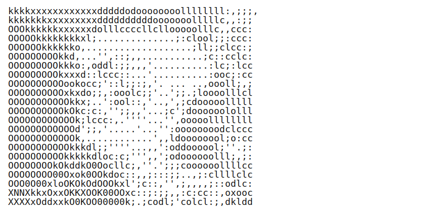

<!-- 
  ╔═══════════════════════════════════════════════════════════════════════════╗
  ║  🎨 Catppuccin Mocha Theme | Crafted with obsession for aesthetics        ║
  ║  💎 Lavender #b4befe | Mauve #cba6f7 | Peach #fab387 | Teal #94e2d5       ║
  ╚═══════════════════════════════════════════════════════════════════════════╝
-->

<p align="left">
  
</p>

<div align="center">

<!-- ANIMATED WAVE HEADER -->


<!-- GLITCH TITLE EFFECT -->
<a href="https://github.com/AryanSakhala">
  
</a>

<br/>

<!-- DYNAMIC TAGLINE -->


<br/><br/>

<!-- QUICK STATS BADGES -->
<p>
  <a href="mailto:ryansakhala@gmail.com">
    
  </a>
  <a href="https://linkedin.com/in/aryan-sakhala-990b46176">
    
  </a>
  <a href="https://github.com/AryanSakhala">
    
  </a>
  <a href="https://pypi.org/user/AryanSakhala/">
    
  </a>
  <a href="https://youtube.com/@AryanSakhala">
    
  </a>
</p>


</div>

<br/>

<!-- ANIMATED DIVIDER -->


<br/>

<!-- ABOUT SECTION WITH BENTO GRID -->
<table align="center" border="0" cellpadding="0" cellspacing="0">
<tr>
<td width="50%" valign="top">

## 🧠 `whoami`

```python
class AryanSakhala:
    def __init__(self):
        self.role = "Lead Software Engineer"
        self.company = "Metrum AI"
        self.clients = ["Dell", "Intel"]
        self.focus = [
            "RAG-based Agentic Systems",
            "Multi-Modal AI Pipelines",
            "Deep Learning @ Scale"
        ]
        self.education = "B.E Computer Engineering"
        self.cgpa = 8.56
        
    def current_mission(self):
        return "Making machines learn faster 🚀"
```

</td>
<td width="50%" valign="top">

## 🏆 Highlights

<br/>

🔬 **Research Contributor** @ Springer LNNS  
↳ *ESG + ML Paper | ISBM 2025, Bangkok*

🎯 **SuperCompute 2024** Showcase  
↳ *Multi-Modal AI Solution*

📚 **Instructor** @ IIT Guwahati  
↳ *5 Batches | Cybersecurity*

🐍 **Open Source** @ PyPI  
↳ *Published Python Libraries*

🎬 **Content Creator**  
↳ *ML/Blockchain Tutorials on YouTube*

</td>
</tr>
</table>

<br/>

<!-- CONTRIBUTION SNAKE -->
<div align="center">
  <picture>
    <source media="(prefers-color-scheme: dark)" srcset="https://raw.githubusercontent.com/AryanSakhala/AryanSakhala/output/github-snake-dark.svg" />
    <source media="(prefers-color-scheme: light)" srcset="https://raw.githubusercontent.com/AryanSakhala/AryanSakhala/output/github-snake.svg" />
    
  </picture>
</div>

<br/>

<!-- GITHUB STATS BENTO -->
<div align="center">

## 📊 GitHub Analytics

<p>
  
  
</p>


</div>

<br/>

<!-- ANIMATED DIVIDER -->


<br/>

<!-- TECH STACK -->
<div align="center">

## ⚡ Tech Arsenal

<br/>

<!-- AI/ML -->
<p>
  
  
  
  
  
</p>

<!-- Languages -->
<p>
  
  
  
  
  
</p>

<!-- Backend & DevOps -->
<p>
  
  
  
  
  
</p>

<!-- Databases & Cloud -->
<p>
  
  
  
  
</p>

</div>

<br/>

<!-- ANIMATED DIVIDER -->


<br/>

<!-- EXPERIENCE TIMELINE -->
<div align="center">

## 💼 Journey

<br/>

<!-- TIMELINE CARDS -->
<table>
<tr>
<td align="center" width="100">

<br/>

</td>
<td>

**Lead Software Engineer** `@Metrum AI`

   

```diff
+ RAG-based Agentic Workflows for Enterprise Clients
+ SuperCompute 2024 — Multi-Modal AI Showcase
```

</td>
</tr>
<tr><td colspan="2"></td></tr>
<tr>
<td align="center" width="100">

<br/>

</td>
<td>

**Research Associate** `@Vidyashilp University`

  

```diff
+ Published: Springer LNNS | ISBM 2025 Bangkok
+ Teaching Assistant — Data Science Course
```

</td>
</tr>
<tr><td colspan="2"></td></tr>
<tr>
<td align="center" width="100">

<br/>

</td>
<td>

**ML Developer** `@EvueMe Selection Robot`

  

```diff
+ AI-powered HR Bot — Talent Acquisition System
+ Dashboard API & Real-time Database Pipeline
```

</td>
</tr>
<tr><td colspan="2"></td></tr>
<tr>
<td align="center" width="100">

<br/>

</td>
<td>

**Data Scientist** `@Sirpi`

  

```diff
+ Led 7-member team — Proofify (Blockchain Doc Transfer)
+ Analytics for IUDX — India Urban Data Exchange
```

</td>
</tr>
<tr><td colspan="2"></td></tr>
<tr>
<td align="center" width="100">

<br/>

</td>
<td>

**B.E. Computer Engineering** `@Pune University`

 

```diff
+ Dr. D.Y. Patil Institute of Engineering
+ Specialized in Artificial Intelligence & Machine Learning
```

</td>
</tr>
</table>

</div>

<br/>

<!-- ACTIVITY GRAPH -->
<div align="center">
  
</div>

<br/>

<!-- QUOTE -->
<div align="center">

## 💭 Random Dev Quote


</div>

<br/>

<!-- FOOTER -->
<div align="center">


<br/>

**"The only way to do great work is to love what you do."**

<sub>💜 If you like what I do, consider starring a repo!</sub>

<br/>


</div>

<!-- 
  Built with 💜 and too much caffeine
  Theme: Catppuccin Mocha
  Last Updated: 2026
-->
